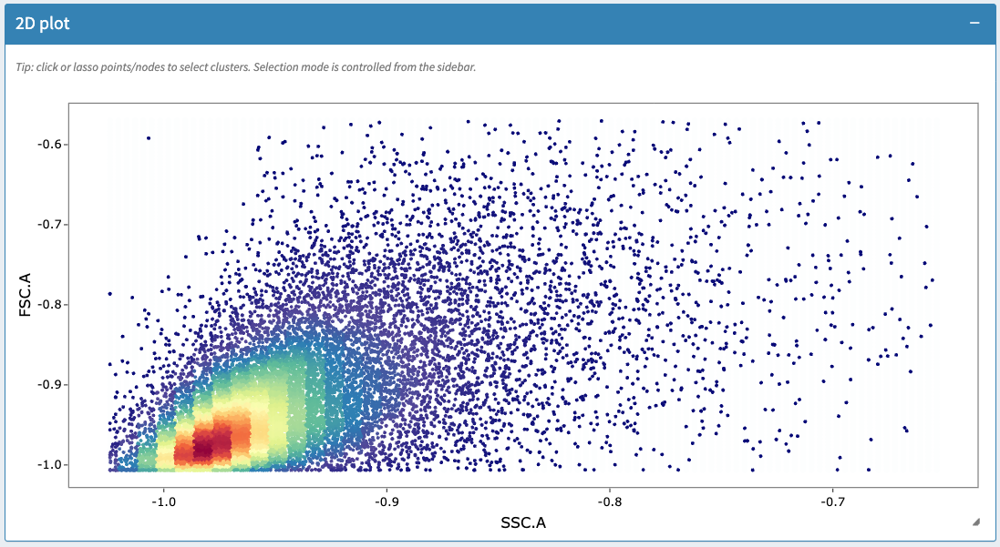
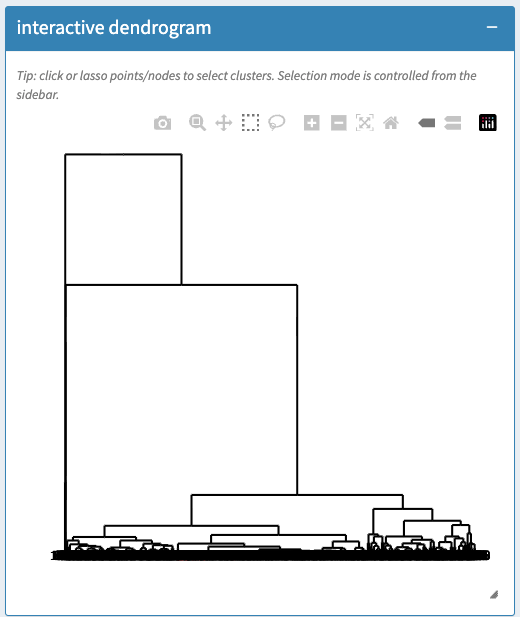
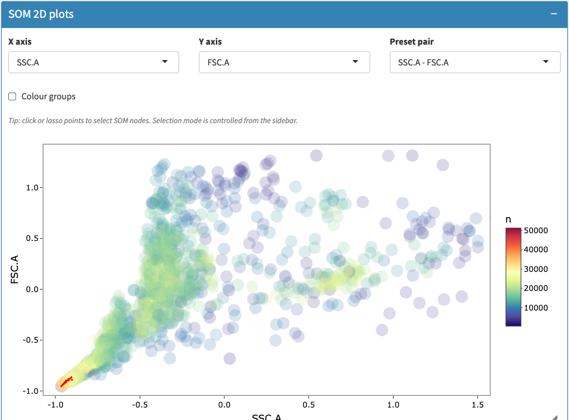
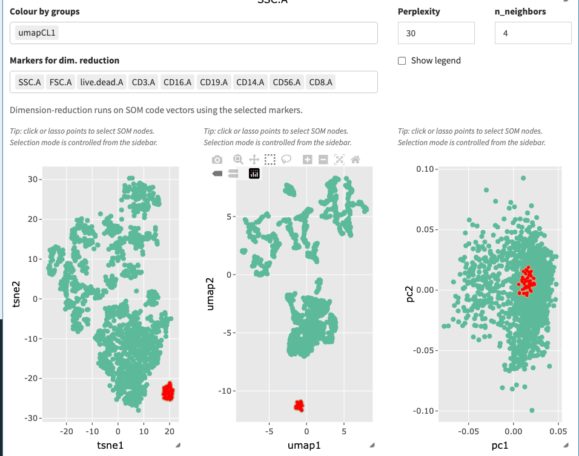
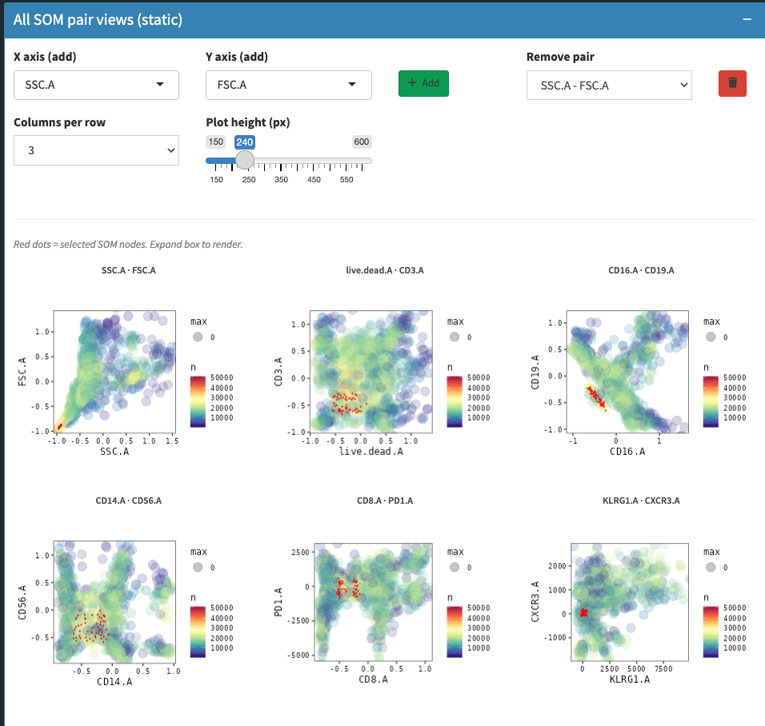
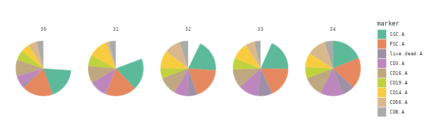
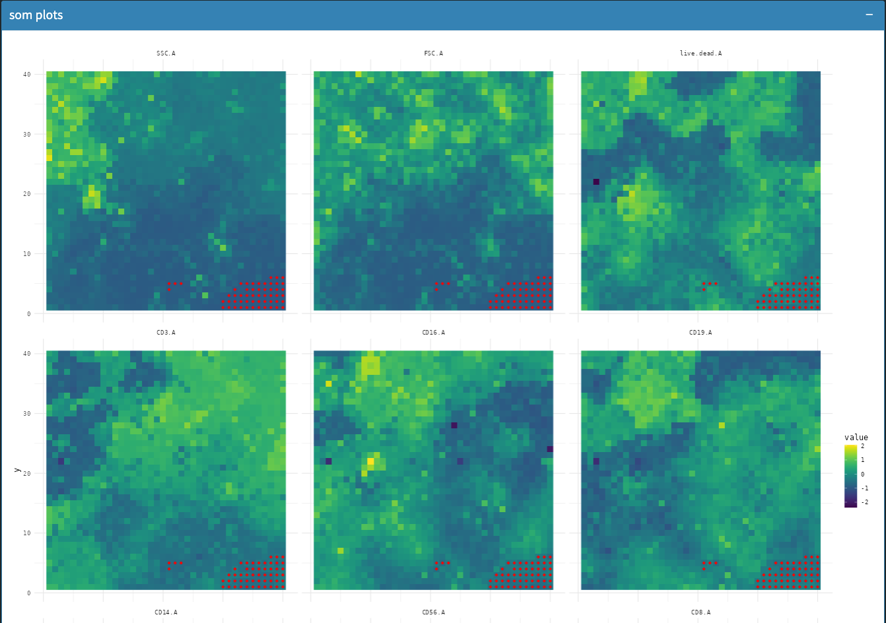

<!-- README.md is generated from README.Rmd. Please edit that file -->

```{r, include = FALSE}
knitr::opts_chunk$set(
  collapse = TRUE,
  comment = "#>",
  fig.path = "man/figures/README-",
  out.width = "100%"
)
```

# CySA

<!-- badges: start -->
<!-- badges: end -->

**CySA** provides an interactive Shiny application for selecting and visualizing
clusters from flow-cytometry data stored in
[`SingleCellExperiment`](https://bioconductor.org/packages/SingleCellExperiment)
objects. It is designed to work with SOM-based clustering outputs such as those
produced by [FlowSOM](https://bioconductor.org/packages/FlowSOM) and curated by
the [CATALYST](https://bioconductor.org/packages/CATALYST) workflow.

## Installation

Install the development version from GitHub with:

``` r
if (!requireNamespace("BiocManager", quietly = TRUE))
    install.packages("BiocManager")

# After Bioconductor acceptance:
BiocManager::install("CySA")

# Development version:
BiocManager::install("baj12/CySA")
```

## Example

```{r example, eval = FALSE}
library(CySA)
library(SingleCellExperiment)

# sce should contain SOM_codes and SOM_stats in metadata(sce)
prepped <- prepClusterSelectorData(sce, total_cells_to_sample = 10000)

# Build the interactive selector app
app <- clusterSelector(
  sce = prepped$sce,
  sce_subsampled = prepped$sce_subsampled,
  dList = prepped$dList
)

# Launch the app
shiny::runApp(app)
```


## Screenshots

The app is organized into linked panels for gating, SOM-based clustering,
and downstream statistics.

### Manual gating and hierarchical clustering

Select cells directly on a 2D scatter plot, or select whole SOM clusters
from an interactive dendrogram:




### SOM node views and dimension reduction

SOM nodes can be explored in raw marker space or via t-SNE/UMAP/PCA
projections of the SOM code vectors, with the current selection highlighted
consistently across views:




### Marker-level exploration of a selection

All marker-pair combinations, per-node marker pie charts, and SOM heatmaps
help characterize the phenotype of a selected cluster:





### Statistics

Selected clusters can be compared between sample groups (e.g. control vs.
treated) with per-sample counts, percentages, and a two-sample t-test:


## Provenance

CySA is derived from the `clusterSelector` Shiny module originally developed in
`CyDa`. The code was subsequently extracted into a standalone Bioconductor
package and refactored with assistance from the opencode AI coding assistant.
All redistributed and AI-assisted code remains under the package license
(see `LICENSE`) and the maintainer is responsible for its maintenance.

## Citation

If you use CySA in your research, please cite the package and the relevant
Bioconductor workflows.
