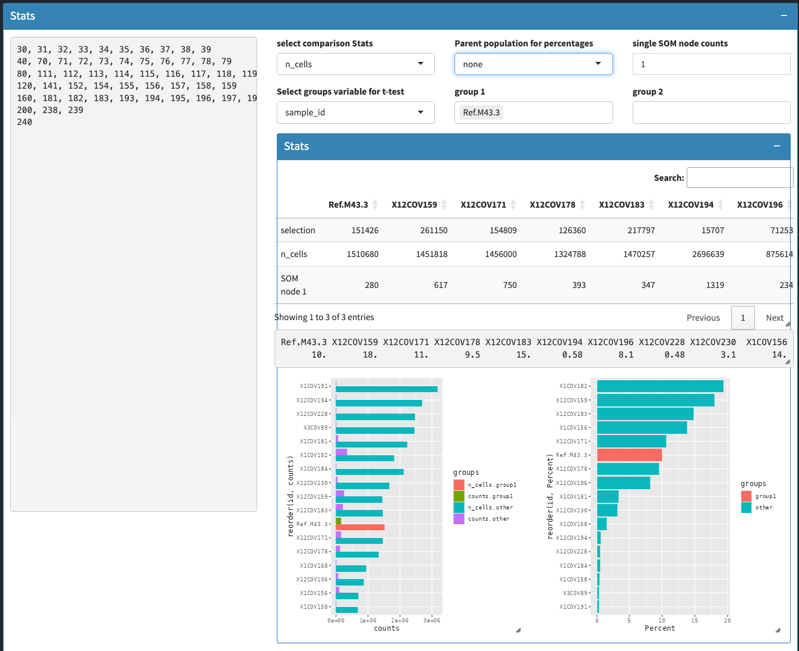

```{r setup, include = FALSE}
knitr::opts_chunk$set(
  collapse  = TRUE,
  comment   = "#>",
  message   = FALSE,
  warning   = FALSE
)
```

# Overview

**CySA** provides an interactive Shiny application for selecting and
visualizing clusters from flow-cytometry data stored in
`SingleCellExperiment` objects. It is designed to work with SOM-based
clustering outputs such as those produced by
[FlowSOM](https://bioconductor.org/packages/FlowSOM) and curated by the
[CATALYST](https://bioconductor.org/packages/CATALYST) workflow.

The main functions are:

* `prepClusterSelectorData()` -- subsample a `SingleCellExperiment` and build
the inputs required by the app.
* `clusterSelector()` -- return a Shiny app object that can be launched with
`shiny::runApp()`.
* `plotSOMScatter()` and `plotCytoScatter()` -- static ggplot2 helpers for SOM
and scatter visualizations.

# Installation

Install the package from Bioconductor with:

```{r install, eval = FALSE}
if (!requireNamespace("BiocManager", quietly = TRUE)) {
  install.packages("BiocManager")
}
BiocManager::install("CySA")
```

# Quick start

`CySA` expects a `SingleCellExperiment` object that contains at least the
following items in `metadata(sce)`:

* `SOM_codes` -- a matrix of SOM node codes (one row per SOM node, one column
per marker).
* `SOM_stats` -- a data frame of per-node statistics with an `id` column.
* `map$colsUsed` -- an optional character vector of markers used for SOM
mapping.

The object should also contain a `sample_id` column and a `cluster_id` column
in `colData(sce)`.

This vignette uses a small example data set shipped with the package:

```{r example-data}
library(CySA)
sce <- CySA_example_sce()
head(S4Vectors::metadata(sce)$SOM_codes)
```

Use `prepClusterSelectorData()` to subsample the data and generate a default
list of marker pairs:

```{r prep-data}
prepped <- prepClusterSelectorData(
  sce,
  total_cells_to_sample = 200,
  somCodesName = "SOM_codes"
)
names(prepped)
```

`clusterSelector()` needs a few additional inputs. Here we build minimal
versions from the example data:

```{r build-inputs}
som_codes <- S4Vectors::metadata(sce)$SOM_codes
markers <- S4Vectors::metadata(sce)$map$colsUsed

dend <- stats::as.dendrogram(stats::hclust(stats::dist(som_codes)))

dendTable <- data.frame(
  id = seq_len(nrow(som_codes)),
  label = rownames(som_codes),
  stringsAsFactors = FALSE
)

clusterPatientTable <- table(
  sample_id = sce$sample_id,
  cluster_id = sce$cluster_id
)

somRasterData <- data.frame(
  x = rep(seq_len(5), length.out = nrow(som_codes)),
  y = rep(seq_len(2), each = ceiling(nrow(som_codes) / 2)),
  id = seq_len(nrow(som_codes))
)
for (m in markers) {
  somRasterData[[m]] <- seq_len(nrow(som_codes)) / nrow(som_codes)
}

arr <- array(
  data = seq_len(10 * 10 * length(markers)),
  dim = c(10, 10, length(markers))
)
somRasterObj <- raster::brick(arr)
names(somRasterObj) <- markers
```

Create the reusable Shiny app object:

```{r cluster-selector}
app <- clusterSelector(
  sce = prepped$sce,
  sce_subsampled = prepped$sce_subsampled,
  dList = prepped$dList,
  dend = dend,
  dendTable = dendTable,
  clusterPatientTable = clusterPatientTable,
  somRasterData = somRasterData,
  somRasterObj = somRasterObj
)
```

Launch the app interactively:

```{r launch-app, eval = FALSE}
if (interactive()) {
  shiny::runApp(app)
}
```

Once launched, the app lets you select cells or SOM clusters from a 2D
scatter plot or an interactive dendrogram:

```{r fig-gating, echo = FALSE, out.width = "49%", fig.show = "hold"}
knitr::include_graphics(c(
  "../man/figures/README-2d-plot.png",
  "../man/figures/README-dendrogram.png"
))
```

SOM nodes can also be explored directly, or via t-SNE/UMAP/PCA projections
of the SOM code vectors, with the current selection highlighted
consistently across all views:

```{r fig-dimred, echo = FALSE, out.width = "49%", fig.show = "hold"}
knitr::include_graphics(c(
  "../man/figures/README-som-2d-plots.png",
  "../man/figures/README-dimreduction.png"
))
```

The interactive session writes the selected cluster groupings back to the
`outputList` object that was passed in.


# Statistical comparison

CySA can compare the relative abundance of selected SOM nodes between two
sample groups. To use this feature, `metadata(sce)$experiment_info` must
contain a grouping column (for example `condition`) and a `sample_id` column
that matches `colData(sce)$sample_id`.

In the app, select:

* **groupsVar** -- the column in `experiment_info` that defines the groups.
* **group1** and **group2** -- the two groups to compare.
* **relativeTo** -- whether to report raw counts, normalize by a numeric column
in `experiment_info`, or normalize by another cluster group.

The Stats panel shows per-sample counts and percentages for the current
selection, along with the t-test result:

```{r fig-stats, echo = FALSE, out.width = "100%"}

```

For each selected SOM node, CySA performs a two-sample t-test on the
relative cell counts between the two groups and displays the result in the
Stats panel.

```{r example with stats}
library(CySA)
library(SingleCellExperiment)
library(S4Vectors)
set.seed(42)

# ── dimensions ────────────────────────────────────────────────────────────────
n_markers <- 12
n_som_nodes <- 50
n_samples <- 6 # 3 control + 3 treated
n_cells <- 300 # per sample

marker_names <- paste0("marker", seq_len(n_markers))
sample_ids <- paste0("S", seq_len(n_samples))
conditions <- factor(
  c(rep("control", 3), rep("treated", 3)),
  levels = c("control", "treated")
)

# ── experiment_info ───────────────────────────────────────────────────────────
# total_cells: cells acquired by the cytometer (used as relativeTo denominator)
experiment_info <- data.frame(
  sample_id = sample_ids,
  condition = conditions,
  total_cells = c(8000L, 9200L, 7800L, 10500L, 11000L, 9800L),
  stringsAsFactors = FALSE
)

# ── SOM codes ─────────────────────────────────────────────────────────────────
# Nodes  1-20 : low expression  → "resting"  phenotype
# Nodes 21-30 : intermediate
# Nodes 31-50 : high expression → "activated" phenotype
som_codes <- matrix(0,
  nrow = n_som_nodes,
  ncol = n_markers,
  dimnames = list(
    paste0("node", seq_len(n_som_nodes)),
    marker_names
  )
)
for (node in seq_len(n_som_nodes)) {
  base <- node / n_som_nodes # 0.02 … 1.00
  som_codes[node, ] <- pmax(0, base + rnorm(n_markers, sd = 0.02))
}

# ── cell assignment ───────────────────────────────────────────────────────────
# Control: 70 % in nodes  1-20  (resting)
# Treated: 70 % in nodes 31-50  (activated)
assign_clusters <- function(condition, n) {
  if (condition == "control") {
    c(
      sample(1:20, round(n * 0.70), replace = TRUE),
      sample(seq_len(n_som_nodes), n - round(n * 0.70), replace = TRUE)
    )
  } else {
    c(
      sample(31:50, round(n * 0.70), replace = TRUE),
      sample(seq_len(n_som_nodes), n - round(n * 0.70), replace = TRUE)
    )
  }
}

coldata_list <- mapply(function(sid, cond) {
  data.frame(
    sample_id = sid,
    cluster_id = assign_clusters(as.character(cond), n_cells),
    stringsAsFactors = FALSE
  )
}, sample_ids, as.character(conditions), SIMPLIFY = FALSE)

coldata_df <- do.call(rbind, coldata_list)
n_total <- nrow(coldata_df) # 1800

# ── assay matrix — each cell ≈ its node's SOM code + noise ───────────────────
exprs_mat <- vapply(seq_len(n_total), function(i) {
  node <- coldata_df$cluster_id[i]
  pmax(0, som_codes[node, ] + rnorm(n_markers, sd = 0.05))
}, numeric(n_markers))
dimnames(exprs_mat) <- list(marker_names, paste0("cell", seq_len(n_total)))

# ── SOM_stats ─────────────────────────────────────────────────────────────────
node_counts <- tabulate(coldata_df$cluster_id, nbins = n_som_nodes)

# summarise marker1 expression per node for hover-text columns
m1 <- exprs_mat["marker1", ]
node_factor <- factor(coldata_df$cluster_id, levels = seq_len(n_som_nodes))

som_stats <- data.frame(
  id = seq_len(n_som_nodes),
  n = node_counts,
  mean = as.numeric(tapply(m1, node_factor, mean)),
  median = as.numeric(tapply(m1, node_factor, median)),
  rdQu = as.numeric(tapply(m1, node_factor, quantile, probs = 0.75)),
  max = as.numeric(tapply(m1, node_factor, max)),
  stringsAsFactors = FALSE
)
# nodes with zero cells get NA from tapply; replace with 0
som_stats[is.na(som_stats)] <- 0

# ── assemble SCE ──────────────────────────────────────────────────────────────
sce_stats <- SingleCellExperiment(
  assays = list(exprs = exprs_mat),
  colData = DataFrame(
    sample_id  = coldata_df$sample_id,
    cluster_id = factor(coldata_df$cluster_id, levels = seq_len(n_som_nodes))
  ),
  metadata = list(
    SOM_codes       = som_codes,
    SOM_stats       = som_stats,
    map             = list(colsUsed = marker_names),
    experiment_info = experiment_info
  )
)
rownames(sce_stats) <- marker_names

# ── clusterPatientTable ───────────────────────────────────────────────────────
clusterPatientTable <- table(
  sample_id  = sce_stats$sample_id,
  cluster_id = sce_stats$cluster_id
)

# ── app inputs ────────────────────────────────────────────────────────────────
prepped <- prepClusterSelectorData(
  sce_stats,
  total_cells_to_sample = 600,
  somCodesName = "SOM_codes"
)

som_codes_mat <- metadata(sce_stats)$SOM_codes
dend <- stats::as.dendrogram(stats::hclust(stats::dist(som_codes_mat)))

dendTable <- data.frame(
  id = seq_len(n_som_nodes),
  label = rownames(som_codes_mat),
  stringsAsFactors = FALSE
)

# SOM raster grid: 10 × 5 layout for 50 nodes
somRasterData <- data.frame(
  x  = rep(seq_len(10), times = 5),
  y  = rep(seq_len(5), each = 10),
  id = seq_len(n_som_nodes)
)
for (m in marker_names) {
  somRasterData[[m]] <- som_codes_mat[, m]
}

app <- clusterSelector(
  sce                  = prepped$sce,
  sce_subsampled       = prepped$sce_subsampled,
  dList                = prepped$dList,
  dend                 = dend,
  dendTable            = dendTable,
  clusterPatientTable  = clusterPatientTable,
  somRasterData        = somRasterData,
  somRasterObj         = NULL
)
```

Launch the app interactively:

How to exercise each statistical feature in the running app
Feature	What to do
Cell counts	Select nodes 1–20 in a SOM plot; Stats tab shows counts per sample
T-test	Set groupsVar = condition, group1 = control, group2 = treated, relativeTo = none; select nodes 1–20; p-value should be large (control-enriched nodes)
T-test (significant)	Same setup but select nodes 31–50 (treated-enriched); expect small p-value
Normalize by total cells	Set relativeTo = total_cells; counts divided by cytometer total
Normalize by another group	Name nodes 31–50 "activated", then set relativeTo = activated for a different selection
UpSet / violin	Name both "resting" (1–20) and "activated" (31–50); UpSet shows overlap, violin shows marker separation

For a closer look at the phenotype of a selection, the app also provides
per-node marker pie charts, all marker-pair views, and SOM heatmaps:

```{r fig-phenotype, echo = FALSE, out.width = "100%"}
knitr::include_graphics(c(
  "../man/figures/README-marker-pies.png",
  "../man/figures/README-som-pairs-grid.png",
  "../man/figures/README-som-heatmaps.png"
))
```

```{r launch-app-2, eval = FALSE}
if (interactive()) {
  shiny::runApp(app)
}
```

# Static plots

For non-interactive use, `plotSOMScatter()` produces a ggplot2 scatter plot of
two SOM channels:

```{r som-scatter}
plotSOMScatter(sce, chs = c("marker1", "marker2"))
```

`plotCytoScatter()` provides an alternative scatter visualization:

```{r scatter-bj}
plotCytoScatter(sce, chs = c("marker1", "marker2"))
```

# Related cytometry workflows

CySA is designed to sit between unsupervised clustering and downstream
interpretation of cytometry experiments. It complements several established
Bioconductor workflows:

* **FlowSOM** — CySA consumes FlowSOM's SOM codes and optionally a FlowSOM
  object to visualise and refine the SOM clustering interactively.
* **CATALYST** — the expected input is a
  `SingleCellExperiment` with `sample_id` and `cluster_id` in `colData`, a
  convention used throughout CATALYST. Marker names and cluster codes are read
  directly from the object.
* **diffcyt / edgeR / limma** — after clusters have been selected and named in
  CySA, the resulting `outputList` can be used to define cell populations for
  differential abundance testing with packages such as
  [diffcyt](https://bioconductor.org/packages/diffcyt),
  [edgeR](https://bioconductor.org/packages/edgeR), or
  [limma](https://bioconductor.org/packages/limma).
* **SingleCellSignalR / scDiffCom** — once populations are fixed, the same
  sample-level metadata can be reused for cell-cell communication or.
  trajectory-oriented analyses.

The interactive step performed by CySA is therefore not a replacement for these
workflows but a bridge: it lets a human curate SOM-derived clusters and then
export clean population definitions for statistical downstream analysis.

# Session information

```{r session-info}
sessionInfo()
```
